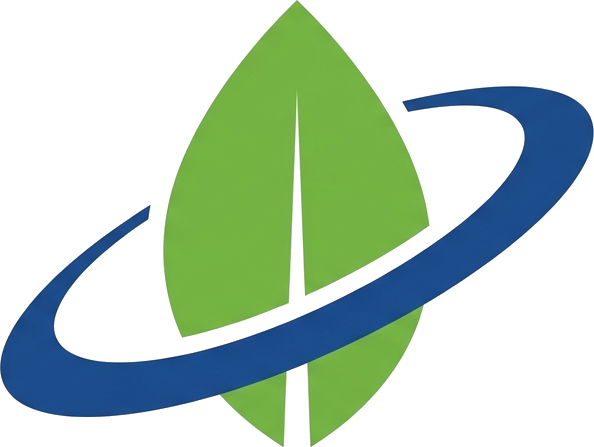

<p align="center">
  
</p>

# NASA Spring Guide

Una guía práctica de Spring Boot construida sobre cuatro APIs públicas de NASA. Hay una aplicación completa y dos ejemplos mínimos para entender cómo se conecta un controlador con un servicio externo.

## Qué se aprende

- Cómo recorre una petición el patrón MVC: controlador, servicio, DTO y plantilla Thymeleaf.
- Llamar a una API externa con `RestClient` y construir URLs con `UriComponentsBuilder`.
- Validar parámetros y tratar los errores `4xx`, `5xx` y `429` sin romper la página.
- Guardar la API key fuera del código y no mostrarla en la respuesta.
- Probar sin red con `MockRestServiceServer`.

## APIs incluidas

| Ruta | API | Qué practicas |
|---|---|---|
| `/asteroids` | Asteroids NeoWs | Query parameters y JSON agrupado por fecha |
| `/techtransfer` | TechTransfer | Búsqueda de patentes y JSON flexible |
| `/donki` | DONKI (FLR) | Colecciones de eventos solares |
| `/epic` | EPIC Natural | Metadatos de imágenes de la Tierra |

## Estructura

```text
apps/apinasa       aplicación completa (Spring Boot + Thymeleaf)
apps/ejemplo-mvc   un @Controller mínimo
apps/ejemplo-rest  un @RestController mínimo
docs/              documentación
landing/           página de presentación (Vite + Vue + elastic-ui)
```

## Tecnologías

Java 25, Spring Boot 4, Thymeleaf, Maven. La landing usa Vite, Vue 3 y elastic-ui.

## Ejecutar

Necesitas Java 25. Pide una clave gratuita en [api.nasa.gov](https://api.nasa.gov/); sin ella se usa `DEMO_KEY`, con una cuota muy baja.

```bash
cd apps/apinasa
cp .env.example .env   # pon tu clave en NASA_API_KEY
./mvnw spring-boot:run
```

La app queda en <http://localhost:8080>. Los detalles, incluidos los ejemplos y la landing, están en [docs/instalacion.md](docs/instalacion.md).

## Documentación

- [Índice](docs/README.md)
- [Instalación y ejecución](docs/instalacion.md)
- [Ejemplos mínimos](docs/ejemplos.md)
- [Conceptos de Spring Boot](docs/conceptos-spring.md)
- [Las APIs de NASA](docs/apis.md)

## Aviso

Proyecto educativo sin relación oficial con NASA.
